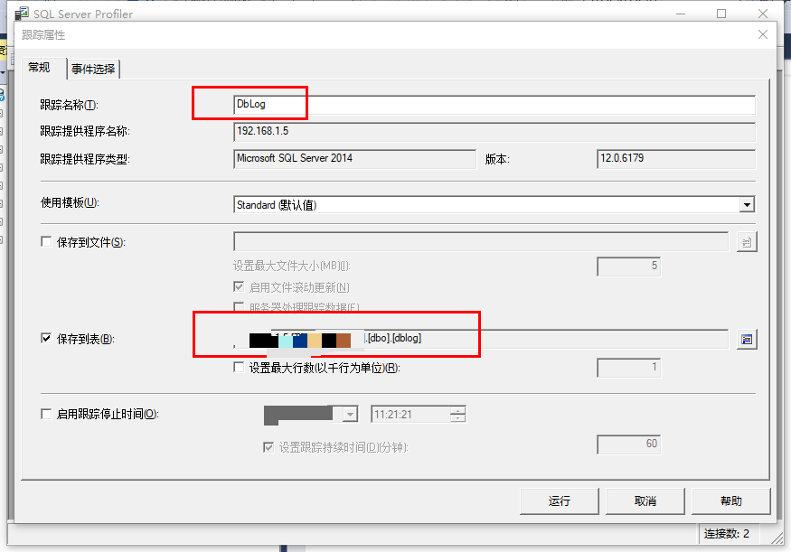
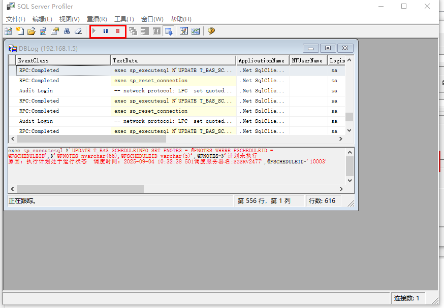

# 通过SQL Server Profiler截获SQL语句

SQL Server Profiler 是微软官方提供的强大数据库监控工具，可以实时捕获 SQL Server 的各种事件，包括 SQL 语句、存储过程、性能瓶颈等。本文将介绍如何使用 Profiler 截获 SQL 语句，并结合实际场景给出操作步骤。

## 1. Profiler简介

SQL Server Profiler 可用于：
- 捕获和分析 SQL Server 执行的所有 SQL 语句
- 监控慢查询、锁等待、死锁等性能问题
- 审计数据库访问和操作
- 追踪应用程序与数据库的交互过程

## 2. 启动 SQL Server Profiler

1. 打开 SQL Server Management Studio (SSMS)
2. 在菜单栏选择【工具】->【SQL Server Profiler】
3. 连接到目标 SQL Server 实例

## 3. 创建跟踪（Trace）

1. 新建跟踪后，选择合适的模板（如“标准”或“TSQL_Replay”）
2. 在“事件选择”页，勾选如下关键事件：
    - **SQL:BatchStarting** / **SQL:BatchCompleted**：捕approved SQL 语句
    - **RPC:Completed**：捕获存储过程调用
    - **Showplan XML**：分析执行计划
3. 可通过“列过滤器”设置数据库、应用名、登录名等过滤条件，精准定位目标语句

## 4. 实时捕获 SQL 语句

- 启动跟踪后，Profiler 会实时显示所有捕获到的 SQL 语句
- 可通过“文本数据”列查看完整 SQL 内容
- 支持暂停、停止、保存跟踪结果为文件或表，便于后续分析

## 5. 常见应用场景

- **性能优化**：定位慢查询，分析 SQL 执行计划
- **故障排查**：捕获异常 SQL，追踪死锁、锁等待
- **安全审计**：记录敏感操作，追踪数据变更
- **开发调试**：分析应用与数据库交互，定位参数传递问题

## 6. 注意事项

- 跟踪期间会对数据库性能有一定影响，建议在测试环境或低峰期操作
- 合理设置过滤条件，避免捕获过多无关数据
- 跟踪结果可导出为 .trc 文件，使用 Profiler 或 T-SQL 进一步分析

## 7. 总结

SQL Server Profiler 是数据库开发和运维不可或缺的利器。通过合理配置和使用，可以高效定位 SQL 问题、优化性能、提升数据库安全性。

> 参考：[官方文档](https://learn.microsoft.com/zh-cn/sql/tools/sql-server-profiler/sql-server-profiler)