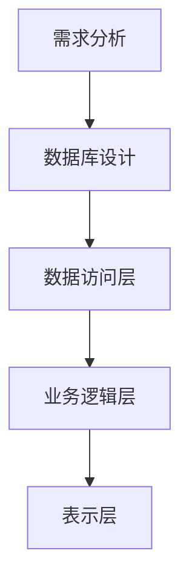
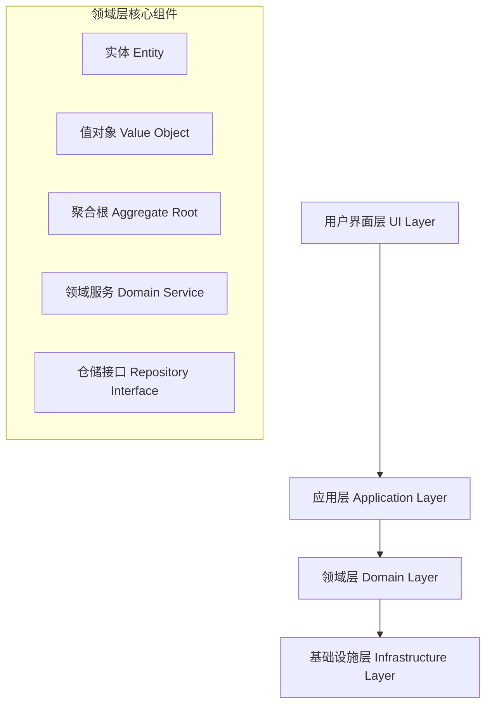
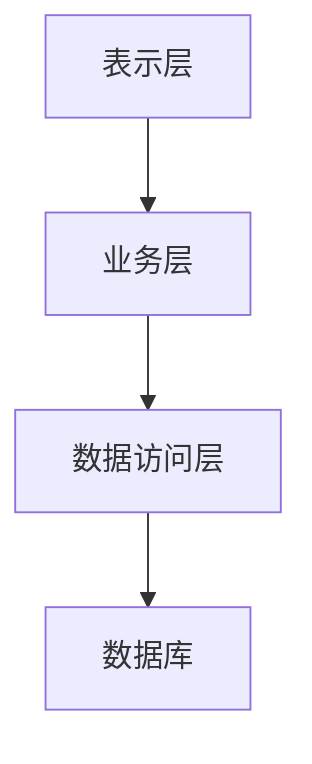
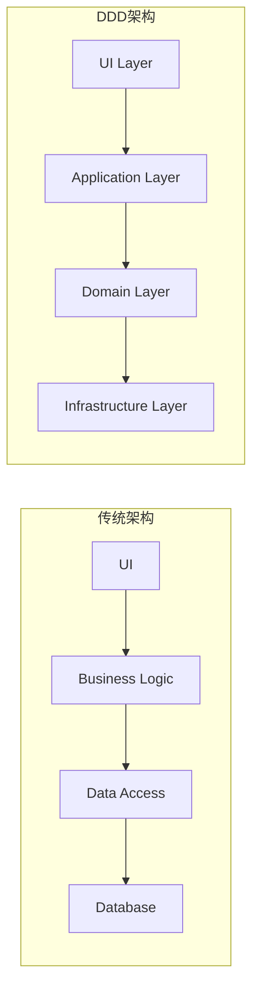
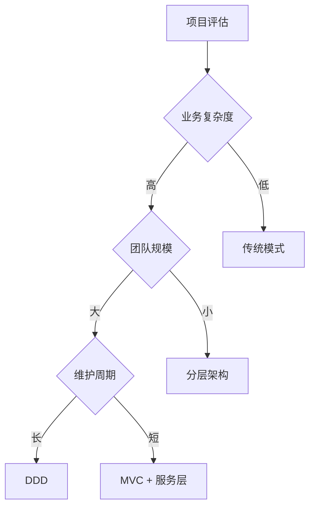

## 前言

在现代软件开发中，选择合适的开发模式对项目的成功至关重要。领域驱动设计（Domain-Driven Design，DDD）作为一种以业务领域为核心的设计方法论，与传统的数据驱动开发模式形成了鲜明对比。本文将深入探讨DDD与其他主流开发模式的差异，帮助开发者更好地理解和选择适合的架构方案。

---

## 一、传统数据驱动开发模式

### 1.1 核心特征

传统的软件开发模式通常以**数据为中心**，重点关注数据库表的设计和数据的存储与检索。这种模式在早期的企业应用开发中占据主导地位。

### 1.2 开发流程



**详细步骤：**

1. **需求分析**：确定需要存储的数据类型和结构
2. **数据库设计**：设计表结构、字段、索引和关系
3. **数据访问层**：实现CRUD操作和数据映射
4. **业务逻辑层**：编写业务处理代码
5. **表示层**：实现用户界面和交互

### 1.3 代码示例

```csharp
// 传统数据驱动模式示例
public class UserService
{
    private readonly IUserRepository _userRepository;
    
    public UserService(IUserRepository userRepository)
    {
        _userRepository = userRepository;
    }
    
    public void CreateUser(string name, string email)
    {
        // 业务逻辑直接操作数据模型
        var user = new User
        {
            Name = name,
            Email = email,
            CreatedDate = DateTime.Now
        };
        
        _userRepository.Save(user);
    }
}
```

### 1.4 优缺点分析

**优点：**
- 开发速度快，学习成本低
- 数据结构清晰，易于理解
- 适合简单的CRUD应用

**缺点：**
- 业务逻辑分散，难以维护
- 数据库结构变化影响整个系统
- 缺乏业务语义表达
- 难以应对复杂业务规则

---

## 二、领域驱动设计（DDD）模式

### 2.1 核心理念

DDD强调以**业务领域为核心**，将复杂的业务逻辑封装在领域模型中，通过统一语言（Ubiquitous Language）连接技术团队和业务专家。

### 2.2 DDD分层架构



### 2.3 DDD核心概念

#### 2.3.1 实体（Entity）

```csharp
public class User : Entity<UserId>
{
    public UserId Id { get; private set; }
    public UserName Name { get; private set; }
    public Email Email { get; private set; }
    public DateTime CreatedDate { get; private set; }
    
    public User(UserId id, UserName name, Email email)
    {
        Id = id ?? throw new ArgumentNullException(nameof(id));
        Name = name ?? throw new ArgumentNullException(nameof(name));
        Email = email ?? throw new ArgumentNullException(nameof(email));
        CreatedDate = DateTime.UtcNow;
    }
    
    public void ChangeName(UserName newName)
    {
        if (newName == null)
            throw new ArgumentNullException(nameof(newName));
            
        Name = newName;
        // 领域事件
        AddDomainEvent(new UserNameChangedEvent(Id, Name));
    }
}
```

#### 2.3.2 值对象（Value Object）

```csharp
public class Email : ValueObject
{
    public string Value { get; private set; }
    
    public Email(string email)
    {
        if (string.IsNullOrWhiteSpace(email))
            throw new ArgumentException("Email cannot be empty");
            
        if (!IsValidEmail(email))
            throw new ArgumentException("Invalid email format");
            
        Value = email.ToLowerInvariant();
    }
    
    private bool IsValidEmail(string email)
    {
        // 邮箱格式验证逻辑
        return Regex.IsMatch(email, @"^[^@\s]+@[^@\s]+\.[^@\s]+$");
    }
    
    protected override IEnumerable<object> GetEqualityComponents()
    {
        yield return Value;
    }
}
```

#### 2.3.3 聚合根（Aggregate Root）

```csharp
public class Order : AggregateRoot<OrderId>
{
    private readonly List<OrderItem> _items = new List<OrderItem>();
    
    public OrderId Id { get; private set; }
    public UserId CustomerId { get; private set; }
    public OrderStatus Status { get; private set; }
    public Money TotalAmount { get; private set; }
    public IReadOnlyList<OrderItem> Items => _items.AsReadOnly();
    
    public Order(OrderId id, UserId customerId)
    {
        Id = id;
        CustomerId = customerId;
        Status = OrderStatus.Draft;
        TotalAmount = Money.Zero;
    }
    
    public void AddItem(ProductId productId, int quantity, Money unitPrice)
    {
        if (Status != OrderStatus.Draft)
            throw new InvalidOperationException("Cannot modify confirmed order");
            
        var existingItem = _items.FirstOrDefault(x => x.ProductId == productId);
        if (existingItem != null)
        {
            existingItem.ChangeQuantity(existingItem.Quantity + quantity);
        }
        else
        {
            _items.Add(new OrderItem(productId, quantity, unitPrice));
        }
        
        RecalculateTotal();
    }
    
    public void Confirm()
    {
        if (Status != OrderStatus.Draft)
            throw new InvalidOperationException("Order is already confirmed");
            
        if (!_items.Any())
            throw new InvalidOperationException("Cannot confirm empty order");
            
        Status = OrderStatus.Confirmed;
        AddDomainEvent(new OrderConfirmedEvent(Id, CustomerId, TotalAmount));
    }
    
    private void RecalculateTotal()
    {
        TotalAmount = _items.Sum(item => item.TotalPrice);
    }
}
```

#### 2.3.4 领域服务（Domain Service）

```csharp
public class OrderPricingService : IDomainService
{
    private readonly IDiscountPolicy _discountPolicy;
    private readonly ITaxCalculator _taxCalculator;
    
    public OrderPricingService(
        IDiscountPolicy discountPolicy,
        ITaxCalculator taxCalculator)
    {
        _discountPolicy = discountPolicy;
        _taxCalculator = taxCalculator;
    }
    
    public Money CalculateFinalPrice(Order order, Customer customer)
    {
        var baseAmount = order.TotalAmount;
        var discount = _discountPolicy.CalculateDiscount(customer, order);
        var discountedAmount = baseAmount.Subtract(discount);
        var tax = _taxCalculator.CalculateTax(discountedAmount, customer.Address);
        
        return discountedAmount.Add(tax);
    }
}
```

### 2.4 应用层协调

```csharp
public class OrderApplicationService
{
    private readonly IOrderRepository _orderRepository;
    private readonly ICustomerRepository _customerRepository;
    private readonly OrderPricingService _pricingService;
    private readonly IUnitOfWork _unitOfWork;
    
    public async Task<OrderId> CreateOrderAsync(CreateOrderCommand command)
    {
        var customer = await _customerRepository.GetByIdAsync(command.CustomerId);
        if (customer == null)
            throw new CustomerNotFoundException(command.CustomerId);
            
        var order = new Order(OrderId.NewId(), command.CustomerId);
        
        foreach (var item in command.Items)
        {
            order.AddItem(item.ProductId, item.Quantity, item.UnitPrice);
        }
        
        var finalPrice = _pricingService.CalculateFinalPrice(order, customer);
        
        await _orderRepository.SaveAsync(order);
        await _unitOfWork.CommitAsync();
        
        return order.Id;
    }
}
```

---

## 三、其他主流开发模式对比

### 3.1 MVC模式

**特点：**
- 关注点分离：Model-View-Controller
- 主要解决UI层的组织问题
- 适合Web应用开发

**与DDD的区别：**
- MVC主要关注表示层架构
- DDD关注整个应用的领域建模
- 可以在MVC的Model层应用DDD原则

### 3.2 分层架构模式



**与DDD分层的区别：**

| 传统分层 | DDD分层 |
|---------|--------|
| 表示层 | 用户界面层 |
| 业务层 | 应用层 + 领域层 |
| 数据访问层 | 基础设施层 |

### 3.3 微服务架构

**DDD与微服务的关系：**
- **限界上下文**为微服务划分提供指导
- **聚合**可以作为服务边界的参考
- **领域事件**支持服务间的异步通信

```csharp
// 微服务中的领域事件发布
public class OrderService
{
    private readonly IEventBus _eventBus;
    
    public async Task ConfirmOrderAsync(OrderId orderId)
    {
        var order = await _orderRepository.GetByIdAsync(orderId);
        order.Confirm();
        
        // 发布领域事件到其他微服务
        await _eventBus.PublishAsync(new OrderConfirmedEvent
        {
            OrderId = order.Id,
            CustomerId = order.CustomerId,
            TotalAmount = order.TotalAmount
        });
    }
}
```

---

## 四、核心差异对比分析

### 4.1 设计理念对比

| 维度 | 传统模式 | DDD模式 |
|------|---------|--------|
| **核心关注点** | 数据存储和检索 | 业务领域和规则 |
| **设计起点** | 数据库表结构 | 领域模型 |
| **业务表达** | 通过数据结构 | 通过领域对象和行为 |
| **复杂度处理** | 分层分离 | 领域建模 |

### 4.2 架构风格对比



### 4.3 代码组织对比

**传统模式：**
```
├── Controllers/
├── Services/
├── Repositories/
├── Models/
└── Data/
```

**DDD模式：**
```
├── Domain/
│   ├── Entities/
│   ├── ValueObjects/
│   ├── Services/
│   └── Repositories/
├── Application/
│   ├── Commands/
│   ├── Queries/
│   └── Services/
├── Infrastructure/
└── Presentation/
```

---

## 五、适用场景分析

### 5.1 DDD适用场景

✅ **推荐使用DDD的情况：**
- 复杂的业务领域
- 业务规则频繁变化
- 需要长期维护的系统
- 团队规模较大
- 有领域专家参与

### 5.2 传统模式适用场景

✅ **推荐使用传统模式的情况：**
- 简单的CRUD应用
- 业务逻辑相对简单
- 快速原型开发
- 小团队项目
- 数据处理为主的应用

### 5.3 选择决策树



---

## 六、实施建议和最佳实践

### 6.1 DDD实施步骤

1. **领域分析**
   - 与领域专家深度合作
   - 建立统一语言
   - 识别核心子域

2. **战略设计**
   - 划分限界上下文
   - 设计上下文映射
   - 确定核心域和支撑域

3. **战术设计**
   - 设计聚合和实体
   - 定义值对象
   - 实现领域服务

### 6.2 常见陷阱和解决方案

**陷阱1：贫血模型**
```csharp
// ❌ 贫血模型
public class Order
{
    public int Id { get; set; }
    public decimal Total { get; set; }
    public List<OrderItem> Items { get; set; }
}

// ✅ 充血模型
public class Order : AggregateRoot
{
    private readonly List<OrderItem> _items = new();
    
    public void AddItem(Product product, int quantity)
    {
        // 业务逻辑封装在领域对象中
        ValidateCanAddItem(product, quantity);
        _items.Add(new OrderItem(product, quantity));
        RecalculateTotal();
    }
}
```

**陷阱2：过度设计**
- 不要为简单场景引入复杂的DDD概念
- 根据实际复杂度选择合适的抽象级别

### 6.3 性能考虑

```csharp
// 使用规约模式优化查询
public class CustomerSpecification : Specification<Customer>
{
    private readonly string _city;
    
    public CustomerSpecification(string city)
    {
        _city = city;
    }
    
    public override Expression<Func<Customer, bool>> ToExpression()
    {
        return customer => customer.Address.City == _city;
    }
}
```

---

## 七、总结

DDD作为一种以业务为核心的设计方法论，在处理复杂业务领域时具有显著优势。它通过领域建模、统一语言和分层架构，有效地将业务复杂性与技术复杂性分离，提高了系统的可维护性和可扩展性。

**关键要点：**

1. **选择合适的模式**：根据项目复杂度、团队能力和业务需求选择
2. **渐进式采用**：可以从传统模式逐步演进到DDD
3. **团队协作**：DDD的成功很大程度上依赖于团队协作和领域知识
4. **持续重构**：随着对领域理解的深入，持续优化领域模型

无论选择哪种开发模式，关键是要理解其适用场景和权衡取舍，在实际项目中灵活运用，以达到最佳的开发效果和业务价值。
