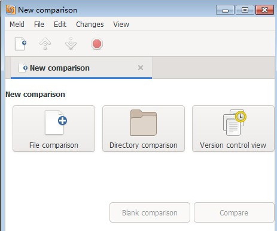
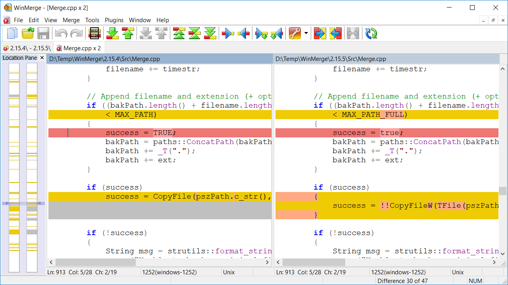
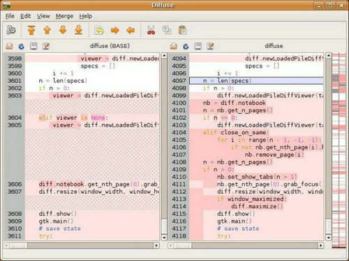
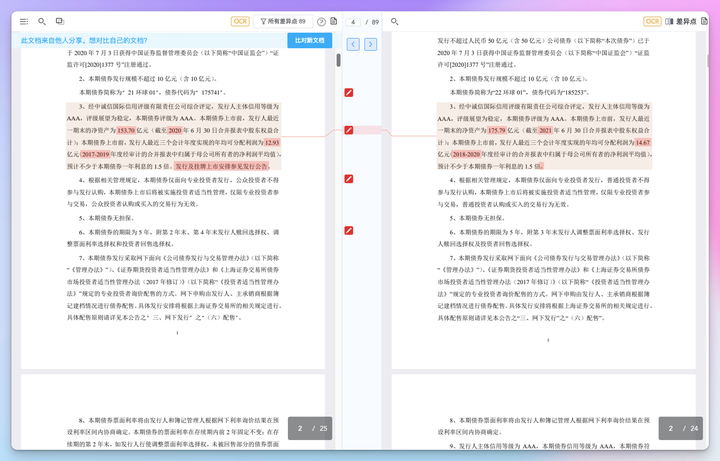

前言
在码代码或做文档的时候，需要对比两个文件的差异，有版本管理工具的时候对比版本就可以，但有时总是这样的或那样的意外，今天在网上找了几个这样的工具做下对比评测。如果你有更好的工具可以留言告诉我。

一、Meld

这是一款开源的文件比对工具，支持Windows、Linux和macOS平台。它提供文件和目录的双向和三方比较，并支持许多流行的版本控制系统。适合开发者和团队协作使用，尤其是在代码合并和版本管理中表现出色。

二、WinMerge

这是一款为Windows设计的免费开源文件比较工具。它可以帮助用户比较文件和文件夹，并以易于管理和理解的视觉文本格式生成差异。WinMerge也可以用作外部比较或合并工具，或作为独立应用程序。它的简单界面非常适合初学者。

三、Beyond Compare
由Scooter Software推出的文件比较工具，主要用途是对比两个文件夹或者文件，并将差异以颜色标示。它还支持文件夹、文件、FTP站点的比较，并且可以高效地找出不同点。此外，Beyond Compare还可以进行文本编辑、代码合并、文件同步等功能。适合需要处理复杂文件结构的用户。

四、Diffuse

这款工具在命令行中的响应速度很快，支持像C++、Python、Java、XML等语言的语法高亮显示。它支持两相比较或者三相比较，也就是说，可以同时比较两个或三个文本文件。适合喜欢命令行操作的开发者。

五、千分尺Calliper

这是一款强大的专业文档内容对比工具，可帮助用户快速准确地比较和分析两个文档之间的差异。它支持doc、docx、pdf、扫描件交叉比对，适用于几百上千页长文档比对，并且支持双屏展示比对效果，差异直观可见。非常适合处理法律文档或技术文档的用户。

总结
以上提到的工具都具有各自的特点，根据需求不同选择也不同。如果只是文本比较的话，还可以在线比较，方便很多。如Diffchecker（一款在线的文档对比工具，无需下载安装，用户只需上传两个文件，即可进行文档对比）、ExamDiff（一款免费的Windows平台下的文档对比软件，可用于比较文件夹、文件和文本内容）等，也是不错的选择。此外，选择工具时还需考虑操作系统支持、功能复杂度以及个人使用习惯。