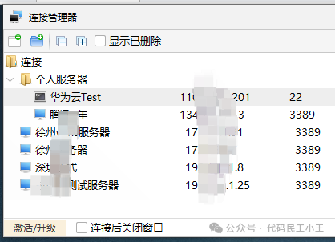
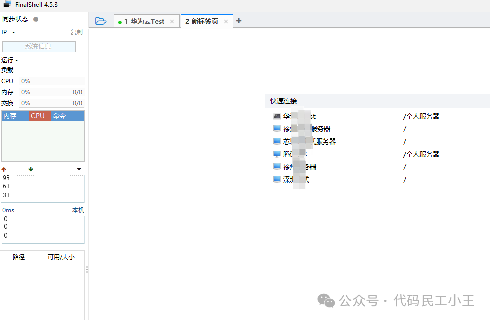
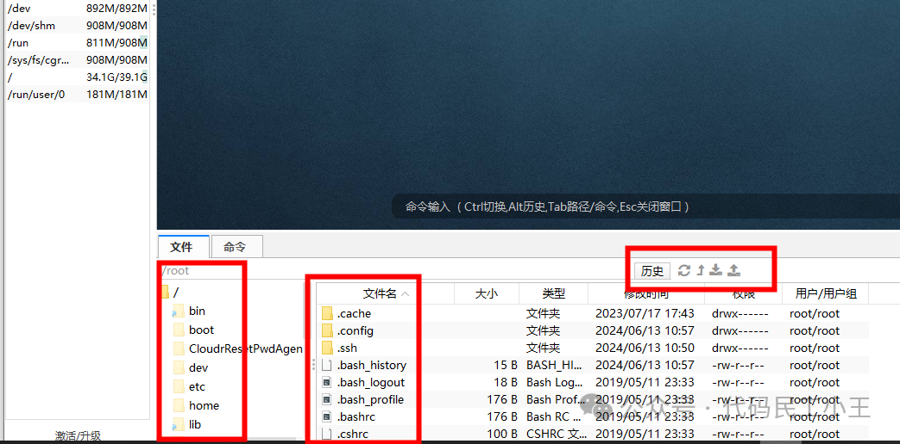
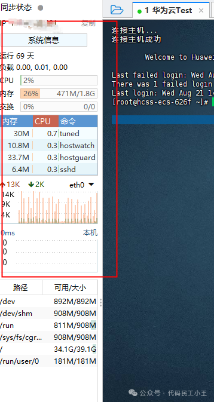
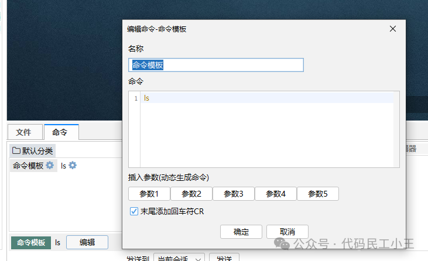

## 前言

在服务器管理的领域，寻找一款功能强大、操作便捷且稳定可靠的工具至关重要。今天，我要向大家强烈推荐一款优秀的服务器管理工具——**FinalShell**。作为一款集SSH客户端、SFTP客户端、系统监控于一体的综合性工具，FinalShell在众多同类产品中脱颖而出，成为了运维人员和开发者的首选工具。

## 一、FinalShell简介

### 1.1 什么是FinalShell

FinalShell是一款免费的集成SSH工具，它不仅仅是一个简单的终端模拟器，更是一个功能全面的服务器管理平台。它将SSH客户端、SFTP客户端、系统监控、网络工具等多种功能集成在一个界面中，为用户提供了一站式的服务器管理解决方案。

### 1.2 主要特点

- **多协议支持**：SSH、SFTP、Telnet、Windows远程桌面
- **跨平台兼容**：支持Windows、macOS、Linux
- **实时监控**：CPU、内存、网络、磁盘等系统资源监控
- **文件管理**：可视化文件传输和管理
- **多标签管理**：同时管理多个服务器连接
- **免费使用**：个人和商业用途均免费


## 二、安装与配置

### 2.1 下载安装

1. **官方网站**：访问 [http://www.hostbuf.com/](http://www.hostbuf.com/)
2. **选择版本**：根据操作系统选择对应版本
   - Windows版本：支持Windows 7及以上版本
   - macOS版本：支持macOS 10.12及以上版本
   - Linux版本：支持主流Linux发行版
3. **安装过程**：
   - Windows：下载exe文件，双击安装
   - macOS：下载dmg文件，拖拽到Applications文件夹
   - Linux：下载对应包文件，按发行版安装方式安装

   

### 2.2 首次配置

启动FinalShell后，建议进行以下基础配置：

```bash
# 设置默认编码为UTF-8
# 在选项 -> 高级 -> 编码设置中选择UTF-8

# 配置字体和主题
# 在选项 -> 外观 中选择合适的字体和主题

# 设置快捷键
# 在选项 -> 快捷键 中自定义常用快捷键
```

## 三、核心功能详解

### 3.1 强大的连接功能

#### SSH连接
FinalShell支持SSH1和SSH2协议，提供多种认证方式：

- **密码认证**：传统的用户名密码方式
- **公钥认证**：更安全的密钥对认证
- **键盘交互认证**：支持多因子认证

**连接配置示例**：
```
主机地址：192.168.1.100
端口：22
用户名：root
认证方式：密码/公钥
编码：UTF-8
```

#### SFTP文件传输

内置SFTP客户端，支持：
- 拖拽上传下载
- 批量文件操作
- 断点续传
- 文件权限管理
- 文件搜索和过滤

#### Windows远程桌面
集成RDP客户端，可直接连接Windows服务器：
```
连接地址：192.168.1.101:3389
用户名：Administrator
密码：********
分辨率：1920x1080
颜色深度：32位
```

### 3.2 直观的界面设计

#### 主界面布局
- **左侧面板**：服务器列表和文件树
- **中央区域**：终端窗口和文件管理
- **右侧面板**：系统监控和工具栏
- **底部状态栏**：连接状态和操作提示

#### 多标签管理
```
# 支持同时打开多个连接
标签1：生产服务器 (192.168.1.100)
标签2：测试服务器 (192.168.1.101)
标签3：开发服务器 (192.168.1.102)
```

### 3.3 高效的文件传输

#### 传输方式
1. **拖拽传输**：直接拖拽文件到目标位置
2. **右键菜单**：通过右键菜单上传下载
3. **快捷键操作**：
   - `Ctrl+U`：上传文件
   - `Ctrl+D`：下载文件
   - `Ctrl+N`：新建文件夹

#### 传输特性
- **多线程传输**：支持多文件并发传输
- **断点续传**：网络中断后可继续传输
- **传输队列**：可查看和管理传输任务
- **传输统计**：实时显示传输速度和进度

### 3.4 丰富的监控功能

#### 系统资源监控
FinalShell提供实时的系统监控功能：

**CPU监控**：
- CPU使用率曲线图
- 多核心CPU分别显示
- 负载平均值显示

**内存监控**：
- 物理内存使用情况
- 交换分区使用情况
- 内存使用率趋势图

**网络监控**：
- 网络接口流量统计
- 实时上传下载速度
- 网络连接状态

**磁盘监控**：
- 磁盘空间使用情况
- 磁盘I/O统计
- 文件系统信息

#### 进程管理
```bash
# 进程列表显示
PID    用户    CPU%   内存%   命令
1234   root    15.2   8.5     nginx
5678   www     5.1    12.3    php-fpm
9012   mysql   25.8   45.2    mysqld
```

### 3.5 便捷的命令行操作

#### 终端功能
- **命令历史**：支持命令历史记录和搜索
- **自动补全**：Tab键自动补全命令和路径
- **多窗口支持**：可同时打开多个终端窗口
- **会话保存**：保存和恢复终端会话

#### 常用快捷键
```
Ctrl+C：中断当前命令
Ctrl+D：发送EOF信号
Ctrl+L：清屏
Ctrl+R：搜索命令历史
Ctrl+A：光标移到行首
Ctrl+E：光标移到行尾
```

#### 命令收藏夹
可以将常用命令保存到收藏夹：
```bash
# 系统信息查看
df -h                    # 查看磁盘使用情况
free -m                  # 查看内存使用情况
top                      # 查看进程信息
netstat -tulpn          # 查看网络连接

# 日志查看
tail -f /var/log/nginx/access.log
tail -f /var/log/mysql/error.log
journalctl -f

# 服务管理
systemctl status nginx
systemctl restart mysql
systemctl reload apache2
```

## 四、高级功能

### 4.1 脚本执行

FinalShell支持批量执行脚本：

```bash
#!/bin/bash
# 系统信息收集脚本
echo "=== 系统信息 ==="
uname -a
echo "=== CPU信息 ==="
lscpu
echo "=== 内存信息 ==="
free -h
echo "=== 磁盘信息 ==="
df -h
```

### 4.2 端口转发

支持本地端口转发和远程端口转发：

```
# 本地端口转发示例
本地端口：8080
远程主机：192.168.1.100
远程端口：80

# 访问 localhost:8080 等同于访问 192.168.1.100:80
```

### 4.3 隧道管理

可以创建SSH隧道进行安全的数据传输：
- **动态端口转发**：创建SOCKS代理
- **本地端口转发**：将本地端口映射到远程服务
- **远程端口转发**：将远程端口映射到本地服务

### 4.4 会话管理

- **会话保存**：保存当前会话状态
- **会话恢复**：断线重连后恢复会话
- **会话分组**：按项目或环境分组管理
- **会话同步**：多台服务器同步执行命令

## 五、跨平台支持

### 5.1 Windows平台
- 完美支持Windows 7/8/10/11
- 集成Windows终端功能
- 支持Windows远程桌面连接
- 与Windows资源管理器无缝集成

### 5.2 macOS平台
- 原生macOS应用体验
- 支持Touch Bar快捷操作
- 与Finder集成
- 支持macOS快捷键习惯

### 5.3 Linux平台
- 支持主流Linux发行版
- 完美的字体渲染
- 支持Linux桌面环境集成
- 命令行启动支持

## 六、安全特性

### 6.1 连接安全
- **SSH密钥管理**：支持RSA、DSA、ECDSA、Ed25519密钥
- **主机密钥验证**：防止中间人攻击
- **连接加密**：所有数据传输均加密
- **会话超时**：自动断开空闲连接

### 6.2 数据安全
- **密码加密存储**：本地密码采用AES加密
- **敏感信息保护**：不在日志中记录敏感信息
- **安全删除**：文件删除时安全擦除

### 6.3 访问控制
```
# 支持的认证方式
1. 密码认证
2. 公钥认证
3. 键盘交互认证
4. GSSAPI认证
5. 证书认证
```

## 七、使用技巧和最佳实践

### 7.1 连接管理技巧

1. **服务器分组**：
```
生产环境/
├── Web服务器1 (192.168.1.10)
├── Web服务器2 (192.168.1.11)
└── 数据库服务器 (192.168.1.20)

测试环境/
├── 测试服务器1 (192.168.2.10)
└── 测试数据库 (192.168.2.20)
```

2. **连接模板**：创建连接模板快速添加相似配置的服务器

3. **批量操作**：选择多个服务器同时执行命令

### 7.2 文件管理技巧

1. **书签功能**：为常用目录添加书签
```
/var/log/nginx/     # 日志目录
/etc/nginx/         # 配置目录
/var/www/html/      # 网站根目录
/home/deploy/       # 部署目录
```

2. **文件搜索**：使用内置搜索功能快速定位文件

3. **权限管理**：直接在界面中修改文件权限

### 7.3 监控使用技巧

1. **告警设置**：设置资源使用率告警阈值
2. **历史数据**：查看系统资源使用历史
3. **性能分析**：通过监控数据分析系统性能瓶颈

### 7.4 自定义配置

```json
{
  "terminal": {
    "font": "Consolas",
    "fontSize": 14,
    "theme": "dark",
    "cursorStyle": "block"
  },
  "editor": {
    "syntax": true,
    "lineNumbers": true,
    "wordWrap": true
  },
  "transfer": {
    "threads": 3,
    "timeout": 30,
    "retryCount": 3
  }
}
```

## 八、常见问题解决

### 8.1 连接问题

**问题1：连接超时**
```bash
# 解决方案
1. 检查网络连通性：ping 目标服务器
2. 检查防火墙设置
3. 验证SSH服务状态：systemctl status sshd
4. 检查端口是否正确
```

**问题2：认证失败**
```bash
# 解决方案
1. 验证用户名密码
2. 检查SSH密钥配置
3. 查看服务器SSH日志：tail -f /var/log/auth.log
4. 确认用户权限设置
```

### 8.2 文件传输问题

**问题1：传输中断**
- 启用断点续传功能
- 检查网络稳定性
- 调整传输线程数

**问题2：权限不足**
```bash
# 解决方案
1. 检查目标目录权限
2. 使用sudo权限
3. 修改文件所有者：chown user:group file
```

### 8.3 性能优化

1. **连接优化**：
```
# SSH配置优化
ServerAliveInterval 60
ServerAliveCountMax 3
TCPKeepAlive yes
Compression yes
```

2. **界面优化**：
- 关闭不必要的监控功能
- 调整刷新频率
- 使用硬件加速

## 九、与其他工具对比

### 9.1 vs PuTTY
| 功能 | FinalShell | PuTTY |
|------|------------|-------|
| 文件传输 | ✅ 内置SFTP | ❌ 需要WinSCP |
| 系统监控 | ✅ 实时监控 | ❌ 无 |
| 多标签 | ✅ 支持 | ❌ 不支持 |
| 跨平台 | ✅ 全平台 | ❌ 仅Windows |
| 界面美观 | ✅ 现代化UI | ❌ 传统界面 |

### 9.2 vs XShell
| 功能 | FinalShell | XShell |
|------|------------|--------|
| 价格 | ✅ 免费 | ❌ 商业软件 |
| 功能完整性 | ✅ 功能全面 | ✅ 功能强大 |
| 易用性 | ✅ 简单易用 | ⚠️ 学习成本高 |
| 中文支持 | ✅ 完美支持 | ✅ 支持 |

### 9.3 vs SecureCRT
| 功能 | FinalShell | SecureCRT |
|------|------------|----------|
| 价格 | ✅ 免费 | ❌ 昂贵 |
| 脚本支持 | ⚠️ 基础支持 | ✅ 强大脚本 |
| 稳定性 | ✅ 稳定 | ✅ 非常稳定 |
| 学习成本 | ✅ 低 | ❌ 高 |

## 十、未来发展和更新

### 10.1 版本更新
FinalShell保持着活跃的更新频率：
- **稳定版**：每季度发布稳定版本
- **测试版**：每月发布测试版本
- **紧急修复**：重要bug及时修复

### 10.2 新功能预览
- **容器支持**：Docker和Kubernetes集成
- **云服务集成**：AWS、阿里云、腾讯云直连
- **团队协作**：多用户协作功能
- **API接口**：开放API供第三方集成

### 10.3 社区支持
- **官方论坛**：用户交流和问题解答
- **QQ群**：实时技术支持
- **GitHub**：问题反馈和功能建议
- **文档wiki**：详细使用文档

## 总结

FinalShell作为一款免费且功能强大的服务器管理工具，在以下方面表现出色：

### 核心优势
1. **功能全面**：集SSH、SFTP、监控、文件管理于一体
2. **操作简便**：直观的图形界面，降低使用门槛
3. **性能稳定**：经过大量用户验证，稳定可靠
4. **完全免费**：个人和商业使用均免费
5. **跨平台支持**：Windows、macOS、Linux全覆盖
6. **持续更新**：活跃的开发团队，功能不断完善

### 适用场景
- **运维工程师**：日常服务器管理和监控
- **开发人员**：代码部署和调试
- **系统管理员**：批量服务器管理
- **学习者**：Linux学习和实践
- **企业用户**：团队协作和标准化管理

### 推荐理由
FinalShell以其强大的功能、便捷的操作和出色的稳定性，成为了服务器管理领域的一款不可多得的优秀工具。无论您是运维新手还是资深专家，FinalShell都能为您提供高效、安全、便捷的服务器管理体验。

如果您还在为寻找一款满意的服务器管理工具而烦恼，不妨试试FinalShell，相信它一定会给您带来意想不到的便利和效率提升。在这个快速发展的技术时代，选择一款优秀的工具，就是选择了更高的工作效率和更好的用户体验。

> **💡 建议**：立即下载FinalShell，开始您的高效服务器管理之旅！
